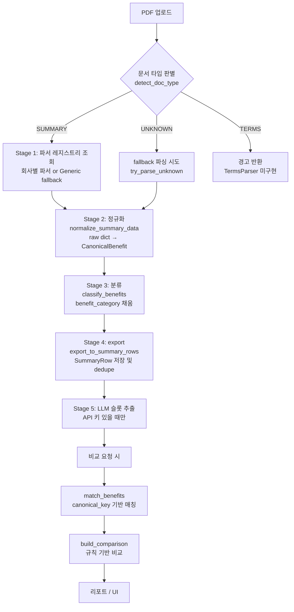
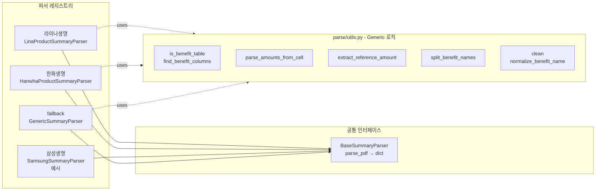

# 보험 특약 비교 분석

PDF 상품요약서를 파싱해 보험사 간 급부를 구조화된 데이터로 비교하고, 인사이트와 리포트를 생성하는 플랫폼.

| 항목 | 내용 |
|------|------|
| 입력 | 보험사 상품요약서 PDF |
| 출력 | 급부별 금액 비교, 보장 범위 비교, 인사이트 카드, Markdown/CSV 리포트 |
| 매칭 | 급부명 → `condition\|disease\|action` canonical_key 변환 후 비교 |
| LLM | 슬롯 구조화(선택), 조건상이 재판정(선택) — 비교 판정 자체는 규칙 기반 |
| 현재 지원 보험사 | 라이나생명, 한화생명 (+ GenericSummaryParser fallback) |

---

## 아키텍처 흐름

### 전체 파이프라인



### 파서 레지스트리 구조



---

## 신규 보험사 추가 — 4단계

### Step 1: 파서 작성

`BaseSummaryParser`를 상속해 `parse_pdf()` 구현:

```python
# src/insurance_parser/parse/samsung_summary_parser.py
from .product_bundle_parser import BaseSummaryParser, register_summary_parser
from .utils import clean, find_benefit_columns, is_benefit_table  # Generic 로직 재사용

class SamsungSummaryParser(BaseSummaryParser):
    def parse_pdf(self, pdf_path):
        ...  # 삼성 PDF 고유 구조만 여기에

def _register():
    register_summary_parser("삼성생명", SamsungSummaryParser)

_register()
```

`parse_pdf()` 반환 스키마 (모든 파서 공통):

```python
{
    "product_name": str,
    "management_no": str,
    "components": {"riders": [str, ...]},
    "contracts": [{
        "name": str, "type": "rider", "source_pdf": str,
        "reference_amount": str,
        "benefits": [{"benefit_names": [...], "trigger": str, "amounts": [...]}],
        "notes": [str]
    }]
}
```

Generic 로직 vs 회사 전용 로직 경계:

| 영역 | 위치 | 내용 |
|------|------|------|
| Generic | `parse/utils.py` | 헤더 컬럼 탐색, 금액 셀 파싱, 기준금액 추출, 급부명 분리 |
| 라이나 전용 | `lina_summary_parser.py` | `□ 무배당` 섹션 탐색, 좌표 기반 fallback, 주석 블록 수집 |
| 한화 전용 | `hanwha_summary_parser.py` | `■ 특약명(코드)` 헤더, letter-spacing 제거, 질병군 분리 |

GenericSummaryParser로도 대부분의 디지털 실선 테이블 PDF를 처리할 수 있다.

### Step 2: 레지스트리 등록

파서 파일 import 시 `_register()` 가 자동 호출된다. `parse/__init__.py`에서 import 추가:

```python
# src/insurance_parser/parse/__init__.py
from . import samsung_summary_parser  # noqa: F401
```

### Step 3: synonyms 파일 추가

회사 특유 급부명 표현을 `config/synonyms_삼성생명.json`에 추가:

```json
{
  "_insurer": "삼성생명",
  "disease": {
    "HER2양성유방암": ["HER2양성유방암", "HER2유방암"]
  }
}
```

파일을 추가하면 코드 수정 없이 자동 로딩된다.

### Step 4: 갭 탐지

파싱 후 canonical_key 매핑이 안 된 급부명 확인:

```bash
python -m tools.check_gaps --insurer 삼성생명
```

갭이 나오면 Step 3으로 돌아가 synonyms 파일에 추가한다.

---

## 파일 구조

```
term_test_v2/
├── app.py                            # Streamlit 진입점
├── views/workbench.py                # UI
│
├── src/insurance_parser/
│   ├── parse/
│   │   ├── utils.py                  # Generic 파서 로직 (모든 파서가 사용)
│   │   ├── product_bundle_parser.py  # BaseSummaryParser + 레지스트리
│   │   ├── lina_summary_parser.py    # 라이나 전용
│   │   └── hanwha_summary_parser.py  # 한화 전용
│   │
│   ├── summary_pipeline/
│   │   ├── models.py                 # 데이터 모델 (CanonicalBenefit, SummaryRow 등)
│   │   ├── pipeline.py               # run_pipeline() 오케스트레이터
│   │   ├── normalizer.py             # Stage 2/4: 정규화 + export
│   │   ├── classifier.py             # Stage 3: benefit_category 분류
│   │   ├── detector.py               # 문서 타입 판별
│   │   └── store.py                  # ArtifactStore (JSON 저장/로드)
│   │
│   ├── comparison/
│   │   ├── normalize.py              # canonical_key + match_benefits
│   │   ├── enrich.py                 # Stage 5: LLM 슬롯 추출
│   │   └── engine.py                 # build_comparison() 비교 엔진
│   │
│   └── llm/openrouter.py             # OpenRouter API 클라이언트
│
├── config/                           # 운영 관리 대상 (코드 수정 없이 편집)
│   ├── synonyms.json                 # 업계 공통 동의어 사전
│   ├── synonyms_한화생명.json         # 한화 특유 표현
│   ├── synonyms_라이나생명.json        # 라이나 특유 표현
│   └── compare_rules.json            # 슬롯별 비교 규칙
│
├── insurance_info/                   # 참고 데이터 (코드에서 직접 사용 안 함)
│   ├── benefit_category_keywords.json
│   ├── 2026년_생명보험표준약관.txt
│   └── kcd9_cancer_codes.json
│
├── tools/check_gaps.py               # canonical_key 갭 탐지 CLI
└── artifacts/                        # 파싱 결과 JSON 저장소
```

---

## 운영 관리 포인트

코드 수정 없이 `config/` 파일만 편집하면 된다.

### `config/synonyms.json` + `config/synonyms_<회사명>.json`

급부 매칭이 안 될 때 수정. 슬롯 3종:

| 슬롯 | 의미 | 예시 |
|------|------|------|
| `action` | 급부 유형 (44종) | 진단, 수술, 항암약물, 통원, 입원, NGS유전자패널검사 |
| `disease` | 질병 분류 (36종) | 일반암, 갑상선암, 기타피부암갑상선암복합 |
| `condition` | 지급 조건 (10종) | 비급여, 급여, 상급종합병원, 3기이상 |

canonical_key 변환 예시:

| 급부명 원문 | canonical_key |
|-----------|--------------|
| 비급여 항암약물·방사선치료자금 | `비급여\|항암방사선` |
| 갑상선암진단자금 | `갑상선암\|진단` |
| 암직접치료상급종합병원통원급여금 | `상급종합병원\|통원` |

### `config/compare_rules.json`

비교 방향 규칙:

| type | 사용 시 |
|------|---------|
| `numeric` | 금액 숫자 비교 — 클수록 유리 |
| `limit_numeric` | "최대 N년/회" 수치 비교 (단위 다르면 비교불가) |
| `none_is_better` | 없는 쪽이 유리 (감액, 면책 등) |
| `display_only` | 방향 없음, 표시만 |

---

## LLM 사용 범위

| 단계 | LLM | 비고 |
|------|-----|------|
| PDF 파싱 | No | PyMuPDF 규칙 기반 |
| canonical_key 매칭 | No | synonyms.json 사전 기반 |
| 금액·슬롯 비교 | No | compare_rules.json 규칙 기반 |
| 인사이트 생성 | No | 추출 데이터 집계 기반 |
| 슬롯 구조화 | 선택 | 비정형 약관 텍스트 → 조건 슬롯 추출 |
| 조건상이 재판정 | 선택 | 수치 비교 불가 케이스 소비자 관점 판정 |

`OPENROUTER_API_KEY` 없이도 모든 기능 동작.

---

## 로컬 실행 / 배포

```bash
# 로컬 실행
pip install -r requirements.txt
streamlit run app.py

# LLM enrichment 활성화 (선택)
cp .env.example .env
# OPENROUTER_API_KEY=sk-or-...
```

```bash
# Hugging Face Spaces 배포
git push github main   # GitHub 백업
git push origin main   # HF Spaces 빌드 트리거
```

HF Spaces 환경변수 (Settings → Repository secrets):
- `OPENROUTER_API_KEY` — LLM enrichment 활성화
- `ARTIFACT_DIR` — artifact 저장 경로 (기본값: `./artifacts`)
